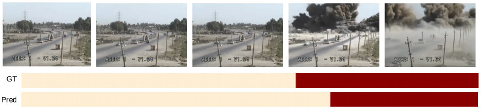
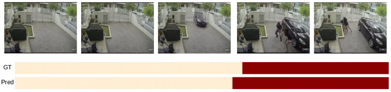

## ADNet: Temporal Anomaly Detection in Surveillance Videos

### Dataset

UCF Crime data set consists of 13 anomaly classes.  We have added two different anomaly classes to the data
set, which are ”molotov bomb” and ”protest” classes. We also have added 33 videos to fighting class. In total, we have added 216 videos to the training set, 17
videos to the test set. Training videos of UCF Crime data set are classified in video-level and temporal annotations are not provided for the training set.
 To train models with temporal information, we annotated anomalies of training videos in temporal domain.

Annotations and videos are publicly available at [the link](https://drive.google.com/file/d/1TnzMzk3TiHJHVsJmqQhzJXvNqml4MijB/view?usp=sharing)

Protest class example

Molotov bomb class example
